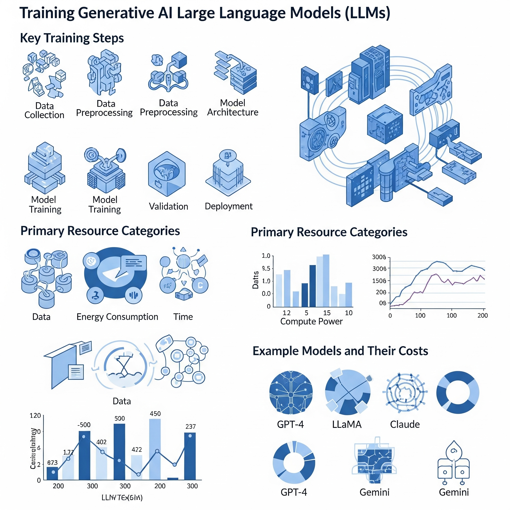

# Training Advanced Generative AI Large Language Models (LLMs)

## Introduction
This artifact contains a complete infographic and detailed documentation that depicts the entire training process of advanced generative AI large language models (LLMs) like as OpenAI's GPT series, Anthropic's Claude, Meta's LLaMA, and Google's Gemini.  It emphasizes the complex workflows and significant resource commitments required to create these cutting-edge models, giving important context for AI practitioners and stakeholders involved in AI development, implementation, and strategy.

## Objective
The primary goal of this artifact is to clearly explain and visually communicate the key stages involved in training generative AI LLMs, as well as to identify and contextualize the major resource categories—including data acquisition, computational power, energy consumption, and training time—in order to improve understanding of the complexity and scale of resources required for developing such models.

## Process
- Conducted extensive research on the training methodologies and infrastructure requirements of the top generative AI LLMs.
- Analyzed publicly available data and academic resources to determine the key resources and their associated costs.
- Designed and created a visually appealing and useful infographic depicting the training pipeline and resource utilization.
- Created companion material that expands on the graphical content, offering extra insights and explanations for a wide range of consumers.

## Tools and Technologies Used
-Markdown is useful for creating clear and structured documentation.
- Use graphic design services like Canva and Adobe Illustrator to create the infographic.
- Git and GitHub are used for version control, collaboration, and portfolio hosting.

## Value Proposition
This artifact demonstrates my ability to distill complex, technical AI concepts into accessible and compelling visual and textual formats, which is critical for effectively communicating with interdisciplinary teams, management, and external stakeholders, facilitating informed decision-making in AI initiatives.
## Unique Value
By offering a detailed and holistic view of the resource demands involved in training generative AI models, this artifact serves as a valuable resource for AI practitioners, investors and policymakers who require a deeper understanding of the operational and financial commitments associated with large-scale AI model development.

## Relevance
A thorough understanding of the infrastructure and resource costs that underpin LLM training is critical for strategic planning in AI research and deployment, as it guides responsible investment, optimizes resource allocation, and addresses ethical concerns about environmental impact and accessibility.

## Infographic

## References
- OpenAI. *How Large Language Models Work*. Retrieved from https://openai.com/research/  
- Meta AI. *LLaMA Model Documentation*. Retrieved from https://ai.facebook.com/research/llama  
- Google AI. *Gemini Project Information*. Retrieved from https://ai.google/  
- Various academic articles and technical papers on generative AI training processes and infrastructure.
- Anthropic. *Claude AI Overview*. Retrieved from https://www.anthropic.com/  

